# 🛍️ Linkon — MERN Stack eCommerce Platform

**Linkon** is a full-featured eCommerce web application built using the **MERN stack** (MongoDB, Express.js, React.js, Node.js). It delivers a fast and modern shopping experience powered by **Vite ⚡** and uses **Cloudinary ☁️** for efficient image management.

It includes complete user functionality along with a powerful admin panel for managing products, users, and orders.

---

## 🚀 Features

### 👤 User Features
- 🛍️ Browse and explore products
- 🔍 View detailed product pages
- 🛒 Add/remove items from cart
- ✅ Secure checkout & order placement
- 🔐 Authentication (Signup/Login)

### 🛠️ Admin Features
- 🔑 Admin authentication
- 📦 Manage products (Add / Edit / Delete)
- ☁️ Upload product images (Cloudinary)
- 👥 Manage users & roles
- 📬 Access customer data

---

## 🧰 Tech Stack

- **Frontend:** React (Vite), Tailwind CSS  
- **Backend:** Node.js, Express.js  
- **Database:** MongoDB (Mongoose)  
- **Authentication:** JWT  
- **State Management:** Redux  

---

## 📁 Project Structure

```bash
linkon/
├── frontend/     # React frontend
├── backend/      # Express backend API
├── sample/       # Screenshots
```
---

## 🖼️ Screenshots

### 📱 Authentication Flow

#### 📝 Signup Page
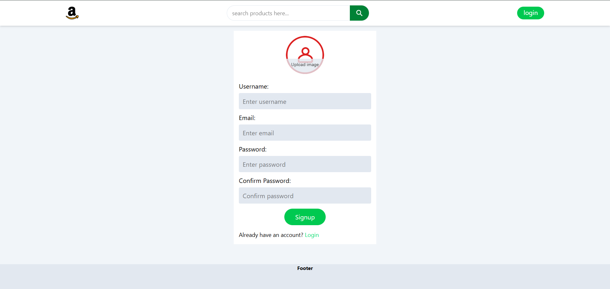

#### 🔑 Login Page
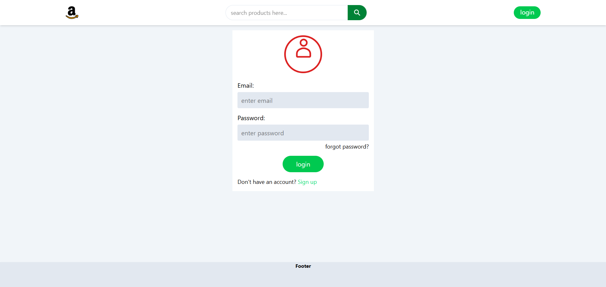


### 🧭 Main Application

#### 🏠 Home Page
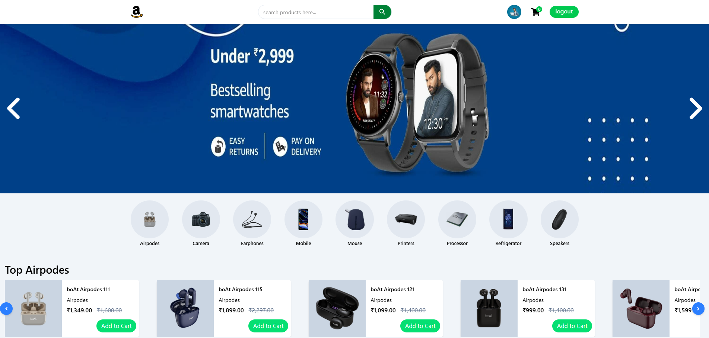

#### 📂 Product Category
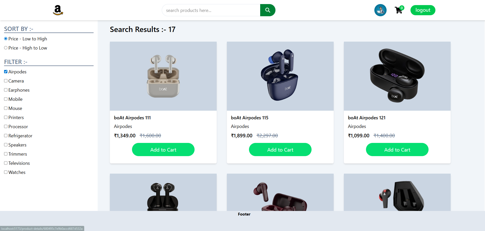

#### 📦 Product Details
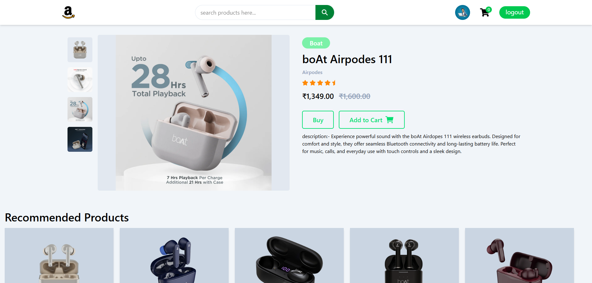


### 🛠️ Admin Panel

#### 📋 All Products
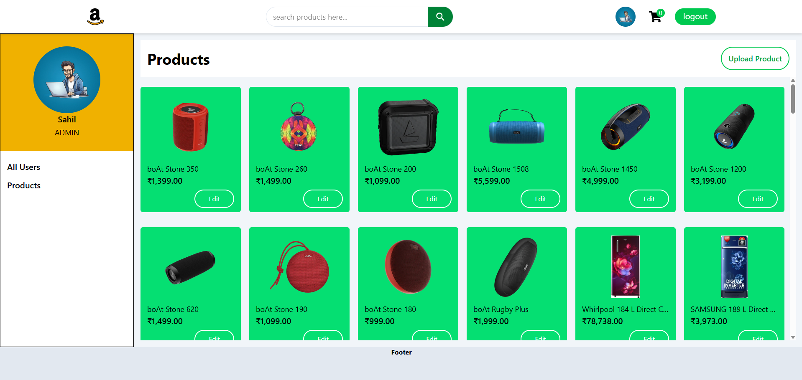

#### ➕ Upload Product
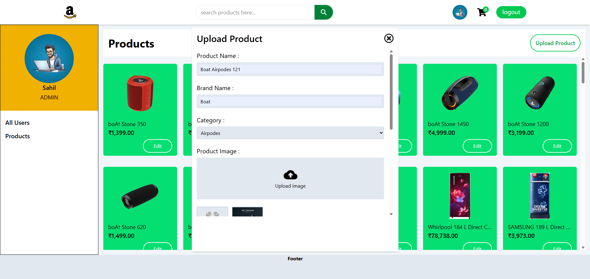

#### ✏️ Edit Product
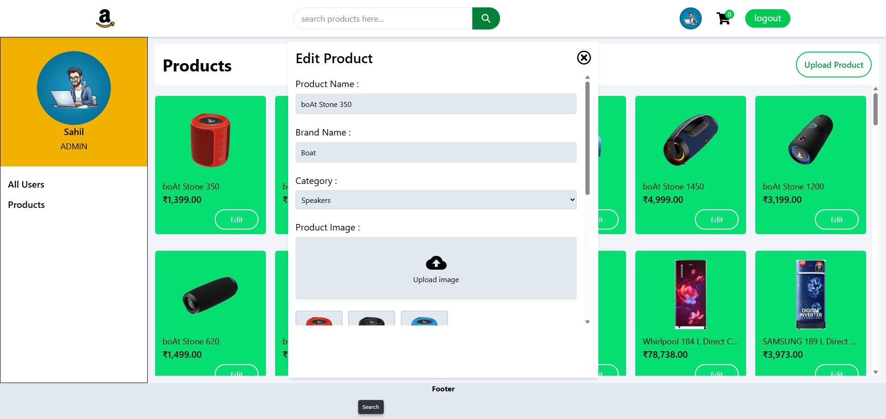

#### 👥 Users List
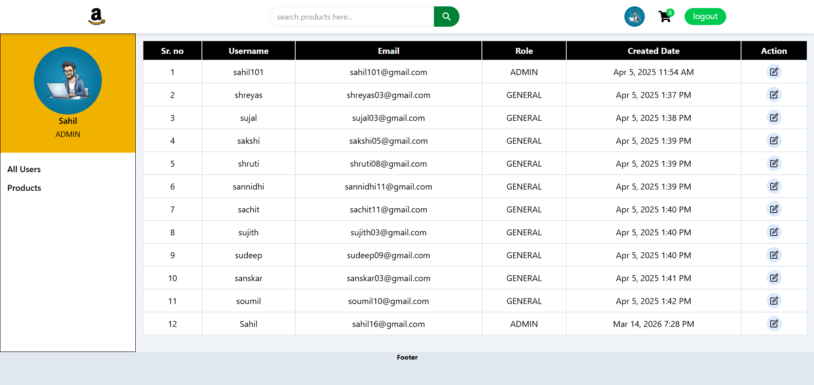

#### 🔄 Change User Role
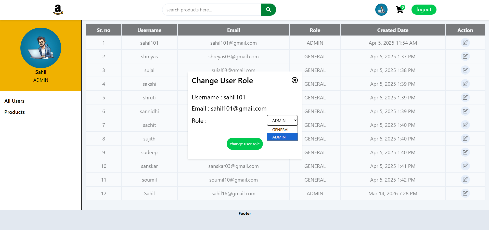

---

### 📱 Mobile View

#### 📝 Signup Page
<p align="center">
  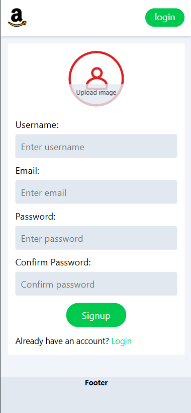
</p>

#### 🔑 Login Page
<p align="center">
  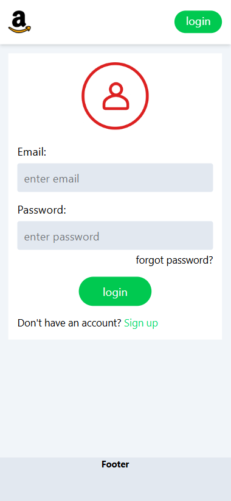
</p>

#### 🏠 Home Page
<p align="center">
  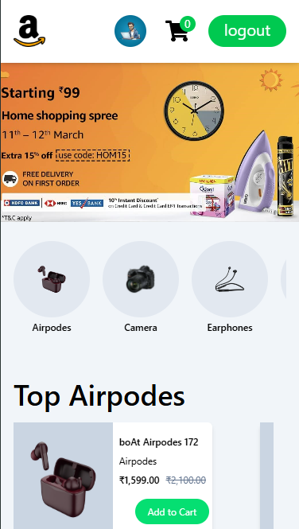
</p>

#### 📂 Category Page
<p align="center">
  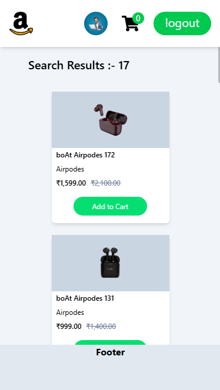
</p>

#### 🏠 Product Page
<p align="center">
  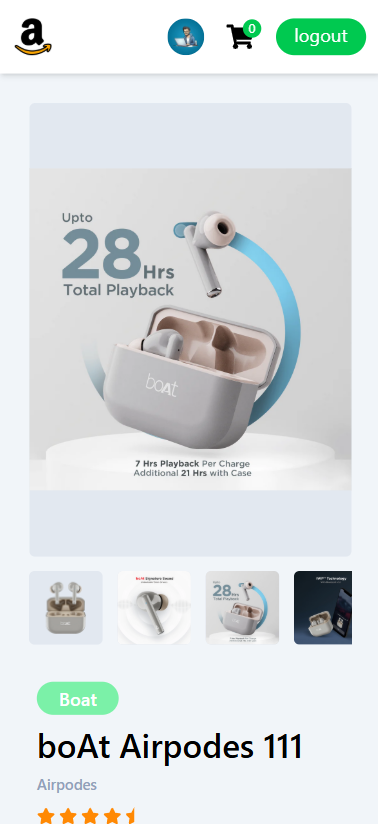
</p>


## ⚙ Getting Started

### ✅ Prerequisites

- Node.js installed
- MongoDB (local or MongoDB Atlas)
- Git

### 📦 Installation Steps

# Step 1: Clone the repo
```bash
git clone https://github.com/Shettysahil16/linkon.git
cd linkon
```
# Step 2: create a .env file in /backend and add the following:
```bash
MONGO_URI = your_mongodb_connection_string
JWT_SECRET = your_jwt_secret
FRONTEND_URL= your_frontend_port
```
# Step 3: Start backend server
```bash
cd backend
nodemon
```
# Step 4: Install frontend dependencies
```bash
cd frontend
npm install moment react-icons react-redux react-router-dom react-toastify
```

 # Step 5: Create a `.env` file in `/frontend` and add the following:

```env
# Create a free Cloudinary account at https://cloudinary.com/
# You'll find your Cloud Name in the Cloudinary Dashboard → Account Details
VITE_APP_CLOUD_NAME=your_cloudinary_id
```


# Step 6: Start frontend server
```bash
npm run dev
```

### ✅ All Set!

Your development environment is ready, and your project should now be up and running 🚀.
